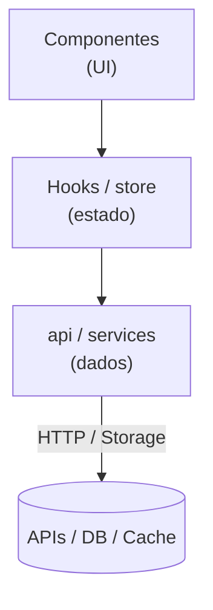

# React + Vite Boilerplate

Starter de produção para times: DX, features em camadas, Mantine, testes, Plop, PWA, i18n e CI.

Sucessor ativo do [react-layered-boilerplate](https://github.com/tiagovilasboas/react-layered-boilerplate). O valor é **clone → (opcional) cleanup → build** — não um hub de Agentic AI.


[](https://github.com/tiagovilasboas/react-vite-boilerplate/actions/workflows/ci.yml)
[](LICENSE)

## 15 minutos

Pré-requisito: **Node.js 20.19+** (Vite 7). O lockfile é **npm**.

```bash
git clone https://github.com/tiagovilasboas/react-vite-boilerplate.git
cd react-vite-boilerplate
npm install
npm run dev
```

Abra `http://localhost:5173`. Os exemplos (greeter, about, counter) existem para você ver a stack. Quando for começar o produto:

```bash
npm run cleanup
```

**Irreversível** no working tree: apaga features/páginas de exemplo e deixa uma Home mínima. Rode `lint`, `test -- --run` e `build` depois.

Agentes de código: leia [`AGENTS.md`](AGENTS.md) primeiro.

## Índice

- [Features](#features)
- [Arquitetura](#arquitetura)
- [AI-assisted](#ai-assisted)
- [Scripts](#scripts)
- [Plop](#plop)
- [i18n](#i18n)
- [PWA](#pwa)
- [Avaliação](#avaliação)
- [Deploy](#deploy)
- [FAQ](#faq)
- [Roadmap](#roadmap)
- [Changelog](#changelog)
- [Contribuindo](#contribuindo)
- [Licença](#licença)

## Features

- **Vite 7** — HMR e build rápidos (porta 5173).
- **React 19 + TypeScript** — tipagem estrita.
- **Mantine 8** — UI acessível; estilos oficiais via CSS (`@mantine/core/styles.css`).
- **Vitest + Testing Library** — testes no mesmo toolchain do Vite.
- **ESLint + Prettier** — qualidade e formatação; a11y e FormatJS em warn.
- **Husky + lint-staged + Commitlint** — pre-commit (lint, type-check, testes) e Conventional Commits.
- **Alias `@/`** — `src/`.
- **PWA** — `vite-plugin-pwa` com ícone SVG placeholder (troque pelos seus PNGs).
- **Camadas** — UI → hooks/store → api/services.
- **i18n** — i18next PT/EN; JSONs em `src/locales/{lng}/{ns}.json` entram via glob.
- **Plop** — `component`, `feature`, `cleanup`.
- **Zod + Mantine Form** — exemplo de validação na home (some no cleanup).
- **CI** — `npm ci`, lint, type-check, testes e build no GitHub Actions.

## Arquitetura

Princípios: SRP, DRY, KISS, YAGNI. Dependências apontam para dentro (Dependency Rule).

```
src/
├── app/                  # router, providers
├── pages/                # rotas (lazy)
├── components/           # UI compartilhada (Plop cria aqui)
├── features/             # módulos (ex.: greeter, counter)
│   └── <feature>/
│       ├── components/
│       ├── hooks/        # alvo da regra; Plop gera store/ como hook
│       ├── api/          # acesso a dados (equivale a services)
│       └── store/        # Zustand (gerado pelo Plop)
├── hooks/                # hooks globais (quando existirem)
├── lib/                  # utilitários
├── stores/               # stores globais
└── types/                # tipos globais
```

Pastas globais (`components/`, `hooks/`, `lib/`, `stores/`, `types/`) nascem vazias até você (ou o Plop) criar arquivos.



## AI-assisted

Agentes: leia [`AGENTS.md`](AGENTS.md) primeiro. Adapters (Cursor, Copilot) são finos; o contrato não vive no README.

## Scripts

| Comando                     | Descrição                                                       |
| --------------------------- | --------------------------------------------------------------- |
| `npm run dev`               | Vite na porta 5173 (`strictPort`).                              |
| `npm run dev:open`          | Igual, abrindo o browser.                                       |
| `npm run build`             | `tsc -b` + bundle de produção (`stats.html` local, gitignored). |
| `npm run preview`           | Serve o `dist`.                                                 |
| `npm run test`              | Vitest (watch fora de CI).                                      |
| `npm run test -- --run`     | Uma execução (CI / pre-commit).                                 |
| `npm run lint` / `lint:fix` | ESLint.                                                         |
| `npm run format`            | Prettier write + ESLint `--fix`.                                |
| `npm run type-check`        | `tsc --noEmit`.                                                 |
| `npm run clean`             | Remove `dist` e cache Vite.                                     |
| `npm run cleanup`           | Remove exemplos (Plop, irreversível).                           |
| `npm run analyze`           | Build de produção (gera `stats.html` local, gitignored).        |

## Plop

```bash
npm run plop -- component
npm run plop -- feature
npm run cleanup
```

| Gerador     | Resultado                                                                   |
| ----------- | --------------------------------------------------------------------------- |
| `component` | `src/components/<Name>/` + teste + JSON i18n (PT/EN).                       |
| `feature`   | `src/features/<name>/` com api, store Zustand, componente Mantine e testes. |
| `cleanup`   | Apaga exemplos e deixa Home mínima. Confirme no prompt.                     |

Namespaces i18n gerados são carregados automaticamente (`import.meta.glob` em `src/i18n.ts`).

## i18n

- Init: `src/i18n.ts` (importado em `src/main.tsx`).
- Default: **PT**. Troque `lng` ou chame `i18n.changeLanguage()`.
- Uso: `useTranslation()` / `useTranslation('namespace')`.

```tsx
import { useTranslation } from 'react-i18next'

function Counter() {
  const { t } = useTranslation()
  return <span>{t('currentValue', { value: 42 })}</span>
}
```

## PWA

O plugin está ligado. O ícone padrão é `public/vite.svg` (placeholder). Para instalação “de verdade” em mobile, coloque PNG 192 e 512 em `public/` e aponte-os no `manifest` de `vite.config.ts`.

## Avaliação

**8/10** — starter de time, não framework.

| Critério       | Nota (0–5) | Comentário                                                       |
| -------------- | ---------- | ---------------------------------------------------------------- |
| Produtividade  | **5**      | Vite, Plop, cleanup, scripts alinhados ao `package.json`.        |
| Escalabilidade | **4**      | Camadas + Zustand; sem SSR/micro-frontends.                      |
| Qualidade      | **5**      | ESLint, testes, type-check e `npm ci` no CI.                     |
| UI             | **4**      | Mantine cobre o comum; DS próprio é extra.                       |
| Onboarding     | **4**      | Tooling (Husky, Commitlint) tem curva; o README começa no clone. |

Falta para 10: SSR/SEO crítico, Storybook/Ladle, auth + cache de dados (TanStack Query) de fábrica. Performance de Lighthouse não é gate de CI.

Encaixa bem em dashboards, SaaS pequeno/médio, MVPs que vão virar produto, e PWAs depois de trocar os ícones.

## Deploy

Instruções em **[docs/DEPLOY.md](docs/DEPLOY.md)** (Node **20**, não 18).

## FAQ

**[docs/FAQ.md](docs/FAQ.md)**

## Roadmap

**[docs/ROADMAP.md](docs/ROADMAP.md)**

## Changelog

**[docs/CHANGELOG.md](docs/CHANGELOG.md)**

## Contribuindo

1. Fork
2. Branch (`git checkout -b feature/AmazingFeature`)
3. Commit no padrão Conventional Commits (`feat: ...`)
4. Push e abra um Pull Request

CI precisa passar: lint, type-check, testes e build.

## Licença

MIT. Ver `LICENSE`.

---

## Autor

**Tiago Vilas Boas**

- LinkedIn: [@tiagovilasboas](https://www.linkedin.com/in/tiagovilasboas/)
- GitHub: [@tiagovilasboas](https://github.com/tiagovilasboas)

De time para time.
